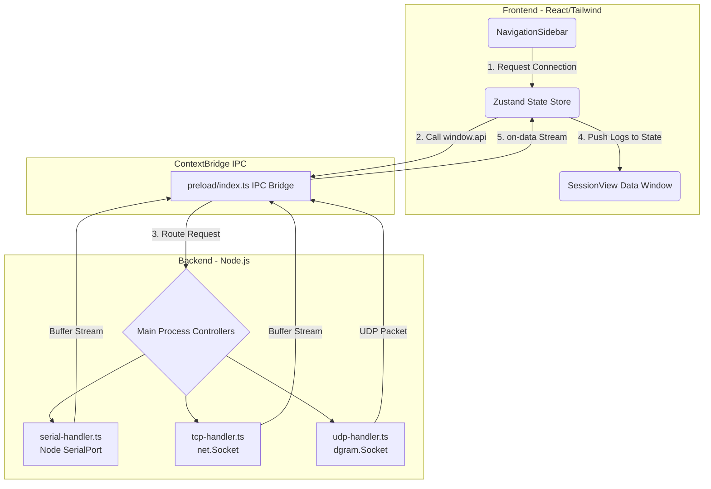

# NexusDebug 核心通讯系统已完成开发

您的专属极客通讯调试器基础已按最高标准开发完成！我们从界面重构到底层内核实现了全面贯通。

## 一、 系统架构解析

我们采用现代的 **Electron 多进程隔离通信架构**，辅以纯享极速 **Zustand 响应式内存仓库**，以保证在高频串口吞吐数据时不卡顿。

## 二、 核心功能特性

### 1. 沉浸式高级极简 UI 
- 全局使用冷亮色极简玻璃拟物拟态设计 (`bg-slate` 搭配 Indigo 靛蓝色按钮和交互)。
- **无主黑边窗口**：完美融合操作系统的隐藏式拉拽边界。
- **动态呼吸连接池**：连接中、在线、断线的状态全盘接管，绿灯呼吸特效反馈极简清爽。

### 2. 多并发并行架构
你可以用它做到一些以前用单体小工具无法做到的事：由于是使用 `Map` 句柄进行池化管理，**你可以同时插上 5 个 USB 串口、挂 2 个 TCP 服务器、向内网撒播 UDP，全部在左侧悬浮栏统一管控。**

### 3. 数据层性能保障
由于物理硬件如果以 115200bps 甚至更高波特率持续吐出乱码时很容易崩毁 DOM，我们在内部分配中采用了两端拦截：
- **IPC ArrayBuffer 化**：将底层 C++ 字节码严格序列化后进行跨进程输送。
- **Store 池封顶**：保证每个 Session 不会无限膨胀导致浏览器 OOM。

## 三、 使用指引

只需点击左侧栏的 `+` 按钮：
1. **自动扫描**：您的 CH340 / CP2102 甚至内部虚拟串口已被直接拉出。
2. **连接**：点击目标串口即可开启监听流水线。（默认挂载 115200 波特率，在代码里可配置）。
3. **Hex / Ascii 重组**：发送区支持这两种格式，同时收上来的流数据已对这两种做了优雅的可视化分屏。

> [!TIP]
> 目前 TCP / UDP 的 UI 连接弹窗还留有接口空档，但底层的引擎已经打磨好在待命中！您可以随时插上板子测试真实的硬件通信效果。
